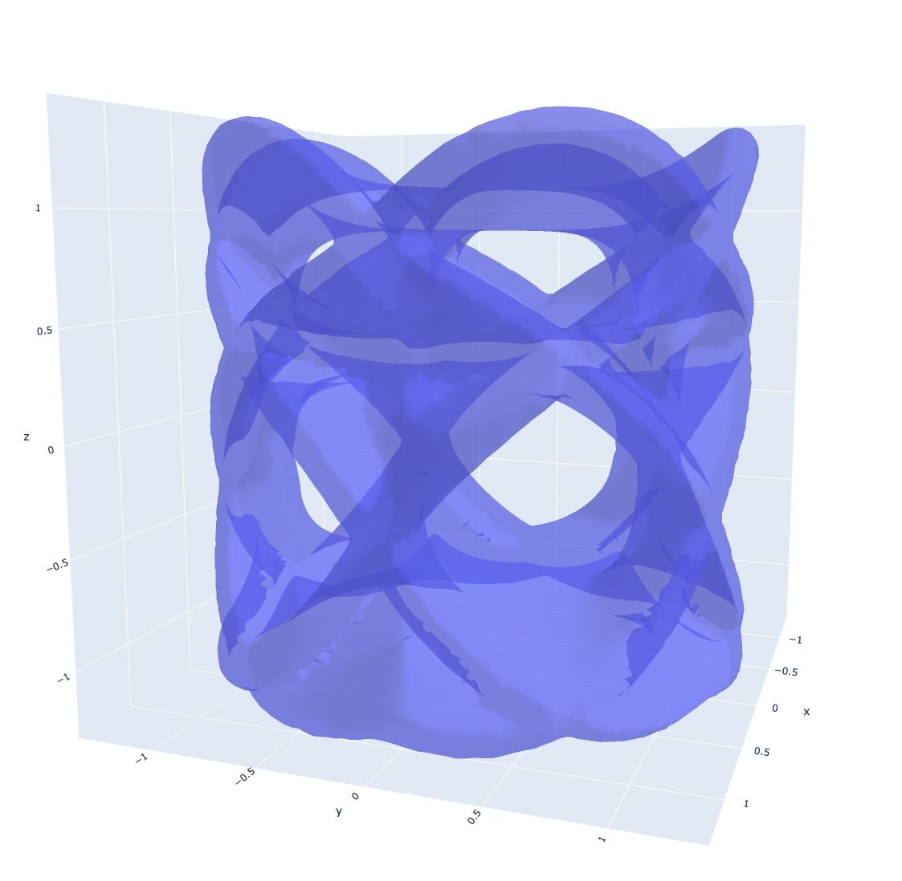

# Calabi–Yau (Fermat quintic) visualizer



https://en.wikipedia.org/wiki/Calabi%E2%80%93Yau_manifold

Python tools to explore the classic **Fermat quintic** Calabi–Yau threefold and a 2‑dimensional slice of it. Includes point samplers, semi‑transparent surface meshes, interactive Plotly controls, parameter explorers, and a marching‑cubes iso‑surface.

> **Geometry in one line:** In homogeneous coordinates on \(\mathbb{CP}^4\), the Fermat quintic is
> \[ z_0^5 + z_1^5 + z_2^5 + z_3^5 + z_4^5 = 0. \]
> On the affine chart \(z_4\neq 0\) and fixing \(a=z_3/z_4\), \(b=z_2/z_4\), a 2‑D real slice is the complex curve
> \[ z_0^5 + z_1^5 = C,\quad C = -(1+a^5+b^5). \]
> We embed \((\Re z_0,\Im z_0,\Re z_1,\Im z_1)\in\mathbb{R}^4\) and project linearly to \(\mathbb{R}^3\) for visualization.

---

## Features
- **Core geometry:** weighted projective spaces, symbolic polynomials, adjunction check for the CY condition.
- **Point samplers:** fast random sampling of the complex curve \(z_1^5+z_2^5=C\) with 1 or all 5 branches.
- **3D views:** Matplotlib and Plotly scatter plots with orbit/zoom.
- **Surface meshes:** triangulated \((r,\theta)\) grids per branch rendered as semi‑transparent Mesh3d.
- **Interactive controls:** yaw/pitch/roll UI, presets, and play/pause animation.
- **Parameter explorers:** animate the complex **phase** of \(C=|C|e^{i\phi}\) for points or surfaces.
- **Iso‑surface:** marching‑cubes reconstruction from a 3D point cloud (KD‑tree distance field).

> **Note:** Visualizations are for intuition; they are **not** metric‑exact embeddings of the Calabi–Yau.

---

## Quick start
### 1) Environment & deps
```bash
python3 -m venv .venv && source .venv/bin/activate
pip install -U pip
pip install -r requirements.txt
```

### 2) Run examples (from the repo root)
```bash
python -m examples.plot_points
python -m examples.plot_surface
python -m examples.surface_param_explorer
python -m examples.iso_surface
```
If you prefer, use `PYTHONPATH=.` and run the scripts directly.

### 3) Install the package (optional)
Editable dev install (creates local `*.egg-info/` metadata, which is fine):
```bash
pip install -e .
```
Build a wheel for distribution:
```bash
pip install build
python -m build --wheel
# → dist/cy-<ver>-py3-none-any.whl
```

---

## Minimal usage
### Plot points on the slice \(z_1^5+z_2^5=C\)
```python
from cy import plotly_quintic_slice
plotly_quintic_slice(C=1, n=12000, branches="all", seed=7)
```

### Semi‑transparent surface (one branch)
```python
from cy import plotly_quintic_slice_surface
plotly_quintic_slice_surface(C=1, branches="principal", r_max=1.2, nr=100, ntheta=200, opacity=0.5)
```

### Interactive controls (yaw/pitch/roll)
```python
from cy import plotly_quintic_slice_with_controls
plotly_quintic_slice_with_controls(C=1, n=14000, branches="all", seed=7)
```

### Parameter explorers
```python
from cy import plotly_quintic_param_explorer_points, plotly_quintic_param_explorer_surface
plotly_quintic_param_explorer_points(C_mag=1.0, phase_steps=24, n_per_phase=6000)
plotly_quintic_param_explorer_surface(C_mag=1.0, phase_steps=12, branches="principal", nr=80, ntheta=160)
```

### Iso‑surface reconstruction
```python
from cy import plotly_quintic_slice_iso_surface
plotly_quintic_slice_iso_surface(C=1, branches="all", n_points=40000, grid_n=72, opacity=0.45)
```

---

## API highlights
- `cy.builders`
  - `fermat_quintic()` → canonical quintic CY in \(\mathbb{CP}^4\)
  - `random_quintic(...)` → random homogeneous quintic
  - `invariants_quintic()` → Hodge numbers `(h11=1, h21=101, euler=-200)`
- `cy.ambient`
  - `WeightedProjectiveSpace(dim, weights)` with quasi‑homogeneity checks
- `cy.hypersurface`
  - `CalabiYauHypersurface(ambient, f)` with fast numeric `lambdify` evals
- `cy.slice`
  - `c_from_affine_constants(a,b)` → \(C=-(1+a^5+b^5)\)
  - `sample_quintic_slice(...)` → `(N×3)` projected point cloud
  - `plotly_quintic_slice(...)`, `visualize_quintic_slice(...)`
- `cy.mesh`
  - `surface_grid_quintic_slice(...)` → surface vertices + faces
  - `plotly_quintic_slice_surface(...)`
- `cy.controls`
  - `plotly_quintic_slice_with_controls(...)` → yaw/pitch/roll UI + animation
- `cy.param_explorer`
  - `plotly_quintic_param_explorer_points(...)`
  - `plotly_quintic_param_explorer_surface(...)`
- `cy.iso`
  - `plotly_quintic_slice_iso_surface(...)` (requires SciPy + scikit‑image)

---

## Projections from \(\mathbb{R}^4\to\mathbb{R}^3\)
All 3D plots use a linear projector `P` (shape `3×4`) acting on `[Re z1, Im z1, Re z2, Im z2]`. You can pass your own matrix to any plotting function via `projector=...`.

Example:
```python
import numpy as np
P = np.array([[1,0,0,0], [0,1,0,0], [0,0,1,0]], dtype=float)  # (x,y,z) <- (Re z1, Im z1, Re z2)
plotly_quintic_slice(C=1, projector=P)
```

---

## Performance tips
- Start with smaller meshes (`nr=60, ntheta=120`) then increase.
- Parameter explorers precompute frames; reduce `phase_steps` if setup is slow.
- Iso‑surface: `grid_n=72` is a good default. Higher grids get heavy quickly.

---

## Troubleshooting
- **`ModuleNotFoundError: No module named 'cy'`** — run from the repo root with `python -m examples.plot_points` *or* `pip install -e .` *or* add `PYTHONPATH=.`.
- **Matplotlib opens static image** — use an interactive backend (`Qt5Agg` or `TkAgg`).
- **SciPy `cKDTree` warnings in IDE** — we import with a KDTree fallback to satisfy type checkers.
- **Pylance type issues** — code uses `lambdify` for numeric evals; if you keep symbolic evals, cast to built‑in `complex` explicitly.
- **SymPy not found** — install with `pip install sympy` (ideally inside a virtualenv).

---

## Development
### .gitignore
```
__pycache__/
*.py[cod]
.venv/
venv/
.env/

build/
dist/
*.egg-info/
.eggs/
pip-wheel-metadata/
wheelhouse/
*.whl

.pytest_cache/
.mypy_cache/
.ruff_cache/
.tox/
.nox/
.DS_Store
.vscode/
.idea/
```

### Packaging
- Editable dev: `pip install -e .`
- Build wheel: `python -m build --wheel`
- Upload to a package index or attach the wheel to a release; don’t commit `dist/`.

---

## License
  Copyright (c) 2025 Kyle Harris

 This software is released under the MIT License.
 https://opensource.org/licenses/MIT

---

## Acknowledgements
- The classic **Fermat quintic** is a standard Calabi–Yau example in \(\mathbb{CP}^4\).
- Thanks to SymPy, NumPy, Matplotlib, Plotly, SciPy, and scikit‑image for the tooling.


